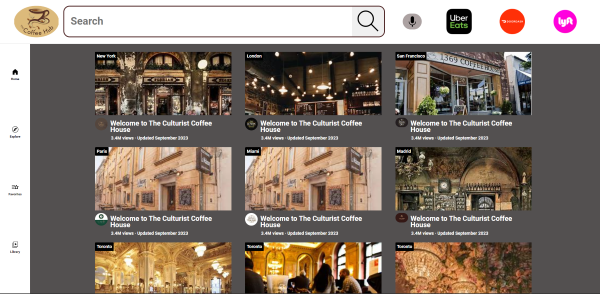

# **COFFEE HUB**
---
SASS
sass --watch style.scss style.css  --style compressed

 

 

 COFFEE HUB is a place where gourmet coffee houses can be located when on the go.  
 
Technologies used in building this site were HTML, CSS and JavaScript.  
 

## *GitHub Repository*  

[Link Here](https://github.com/JosieSavill/coffee-hub)
 
 

## *Deployed Application URL on GitHub Pages*

[Link Here](https://josiesavill.github.io/coffee-hub/)  

 

## *Description*  

When entering the site, the viewer is presented with header containing the site logo, search bar, navbar of clickable icons, sidebar of  
navigable icons and in center the main page containing multiple rows of thumbnail images of client businesses.  
The nav bar provides highly visible icons that link to advertisers of the site and upon hover, suggestions appear for the viewer.  
Examples included are icons of Uber Eats and Door Dash that link to their businesses with upon hover message "order here" appears giving  
giving viewer ability to use sponsor's business to order in some coffee.  A Lyft link upon hover displays message "catch a ride" giving  
the viewer the ability to use sponsor's business to visit one of the client's locations.  
Side bar has vertical row of clickable icons.  
Main body contains images of the client's coffee houses along with location, link to client's about page, date of business establishment,  total views and date of last upate.    

Future developments include the ability for the viewer tyo click on coffee house thumbnail and then navigate to an about page designed  
by the client and providing the client with the ability to continuously update their own page as desired.  
Another feature will be databases linded tothe sidebar icons that will provide viewers with the ability to build lists of favorites and access various database libraries.  

 
 

    

